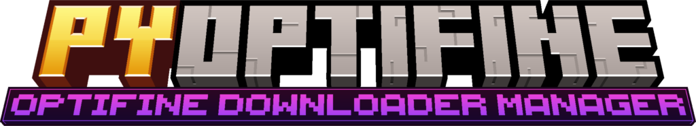

<div align="center">
  
</div>

**PyOptifine** es un **gestor avanzado y automatizador de OptiFine** escrito en **Python**, diseñado para:

* 📥 Descargar automáticamente **todas las versiones de OptiFine** desde sus mirrors oficiales
* 🔧 **Instalar OptiFine sin interfaz gráfica** mediante automatización del instalador oficial
* 📦 Generar manifiestos JSON con metadata completa para launchers y herramientas
* 🛠️ Facilitar integración en scripts, launchers y servidores
* ⚡ Ejecutar descargas en paralelo y generar reportes de progreso

El proyecto está pensado para **usuarios avanzados** y **desarrolladores** que necesiten **control total** sobre las versiones de OptiFine.

---

## ⚠️ DISCLAIMER LEGAL

**PyOptiFine es open-source y automatiza procesos que puedes hacer manualmente:**

* ✅ Descarga OptiFine desde mirrors oficiales
* ✅ NO distribuye OptiFine ni versiones modificadas
* ✅ Automatiza el instalador oficial sin reemplazarlo
* ✅ Uso personal y educativo

### Derechos de Propiedad

* **OptiFine:** sp614x, todos los derechos reservados, [optifine.net](https://optifine.net)
* **Minecraft:** Mojang Studios / Microsoft, requiere licencia válida
* **PyOptiFine:** NovaStepStudios, MIT License, NO afiliado a OptiFine o Mojang

---

## ⚙️ Cómo Funciona

1. **Descarga:** Scraping de mirrors oficiales + descarga directa + verificación de integridad
2. **Instalación automatizada:**

   * Decompilación temporal del instalador
   * Inyección de argumentos CLI (`--mcdir`)
   * Recompilación y reempaquetado del JAR
   * Ejecución automática y limpieza de temporales
3. **Seguridad:** OptiFine final idéntico al oficial, cambios reversibles, sin permisos de admin

---

## 🚀 Características

* Descarga de versiones estables y preview/beta
* Filtrado por versión mínima de Minecraft
* Descargas en paralelo y multithreading configurable
* Generación de manifiestos JSON completos
* Interfaz CLI y menú interactivo
* Arquitectura modular y fácil integración en otros proyectos

---

## 🛠️ Requisitos

* **Python 3.8+**
* **Java JDK** con `javac`

  * Linux: Fedora/DNF, Ubuntu/APT, Arch/Pacman
  * Windows: Oracle o Adoptium
  * macOS: brew install openjdk
* Minecraft instalado
* Conexión estable a internet y ~500MB de espacio

---

## ▶️ Uso Básico

* Mostrar ayuda: `python3 Main.py help`
* Descargar versiones: `python3 Main.py download --min-version 1.16 --threads 10 --no-previews`
* Generar manifiesto: `python3 Main.py manifest`
* Instalar OptiFine: `python3 Main.py install --jar OptiFine_1.20.1_HD_U_I5.jar --mcdir /ruta/a/.minecraft`
* Ejecutar todo: `python3 Main.py all --min-version 1.12 --threads 20`

---

## 🧭 Menú Interactivo

Opciones al ejecutar sin argumentos:

1. Configurar versión mínima de Minecraft
2. Incluir/excluir previews/beta
3. Ajustar hilos para descargas paralelas
4. Ejecutar descarga
5. Generar manifiesto JSON
6. Ejecutar todo (descarga + manifiesto)
7. Instalar OptiFine desde archivo local

---

## 📄 Formato del Manifiesto JSON

Campos:

* `minecraft_version`, `optifine_version`, `mirror_url`, `forge_version`, `release_date`, `filename`, `changelog_url`

Uso: Launchers, mirrors locales, automatización de instalaciones, monitoreo de versiones

Ejemplo:

```json
[
  {
    "minecraft_version": "1.21.10",
    "optifine_version": "OptiFine HD U J7 pre11",
    "mirror_url": "http://optifine.net/adloadx?f=preview_OptiFine_1.21.10_HD_U_J7_pre11.jar",
    "forge_version": "Forge 60.1.0",
    "release_date": "03.12.2025",
    "filename": "preview_OptiFine_1.21.10_HD_U_J7_pre11.jar",
    "changelog_url": "changelog?f=preview_OptiFine_1.21.10_HD_U_J7_pre11.jar"
  }
  Etc...
```

---

## 🤝 Contribuir

* Reportar bugs en GitHub
* Sugerir features con etiqueta `enhancement`
* Pull Requests: fork → branch → commit → push → PR

---

## 📞 Contacto

* GitHub Issues para bugs/features
* Autor: NovaStepStudios
* Proyecto: [PyOptiFine en GitHub](#)

**Disclaimer:** Automatización de instalaciones legítimas de OptiFine, uso educativo y de desarrollo.
